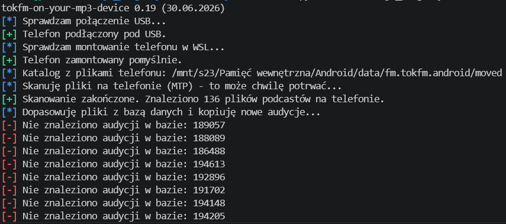

# TOK FM on your MP3 Device (tokfm-oymd)

Aplikacja kliencka dla systemu **Linux / WSL** służąca do automatycznego zgrywania, katalogowania i porządkowania podcastów z aplikacji mobilnej TOK FM bezpośrednio z telefonu podłączonego pod USB (MTP).

Skrypt automatycznie odczytuje pliki `.mp3` pobrane na telefonie, odpytuje bazę danych i stronę TOK FM w celu odtworzenia oryginalnych nazw odcinków, po czym kopiuje je do uporządkowanej struktury katalogów na Twoim komputerze.

## 🚲 Dlaczego powstał ten projekt? (Motywacja)

Autor aplikacji często jeździ rowerem i w tym czasie chętnie słucha audycji TOK FM. Słuchanie bezpośrednio ze smartfona ma jednak spore wady – szybko rozładowuje baterię telefonu, a obsługa ekranu dotykowego podczas dynamicznej jazdy jest skrajnie niewygodna i niebezpieczna. 

Zdecydowanie lepszym, trwalszym i bezpieczniejszym rozwiązaniem jest korzystanie z dedykowanego odtwarzacza MP3/MP4 z fizycznymi przyciskami w połączeniu ze słuchawkami zausznymi (np. kostnymi). Pozwala to na komfortowe słuchanie ulubionych audycji przy zachowaniu pełnego kontaktu z otoczeniem i słyszeniu dźwięków ruchu drogowego (np. nadjeżdżających z tyłu samochodów). Ten projekt powstał po to, aby błyskawicznie przetransferować i uporządkować legalnie pobrane pliki podcastów na tradycyjne urządzenie grające.

> [!NOTE]  
> Program został zoptymalizowany pod kątem działania w środowisku Linux (w tym WSL - Windows Subsystem for Linux).

> [!TIP]
> Aplikacja została oryginalnie stworzona kilka lat temu przez [kerszl](https://github.com/kerszl). W 2026 roku kod przeszedł gruntowną modernizację, optymalizację oraz dostosowanie do nowego układu strony TOK FM w trybie pair-programmingu z asystentem AI **Antigravity** od Google DeepMind.

> [!IMPORTANT]
> **Ważna informacja prawna:**
> * Repozytorium **nie zawiera ani nie udostępnia żadnych plików audycji czy materiałów dźwiękowych**.
> * Aby pobrać podcasty na swój telefon (które ten skrypt następnie kopiuje i porządkuje), **musisz posiadać aktywny abonament TOK FM Premium**. Skrypt służy wyłącznie jako pomocnicze narzędzie do porządkowania własnych, legalnie pobranych plików na prywatnym odtwarzaczu.

---

## 🚀 Główne Funkcje

* **Logowanie w stylu `pwntools`:** przejrzyste, kolorowe i animowane komunikaty w konsoli informujące o postępie prac (`[*]`, `[+]`, `[-]`).
* **Automatyczne wykrywanie katalogów telefonu:** automatycznie rozpoznaje strukturę katalogów aplikacji TOK FM na telefonie (`/moved/` lub `/files/`).
* **Inteligentne połączenie WSL-USB (MTP):** weryfikuje połączenie telefonu przez USBIPD w WSL, a w razie potrzeby automatycznie montuje telefon przez `jmtpfs`.
* **Dynamiczny Fallback:** jeśli na telefonie znajduje się plik odcinka, którego nie ma w lokalnej bazie danych, program w locie pobierze metadane bezpośrednio z dedykowanej strony podcastu.
* **Wypełnianie luk w bazie:** zaawansowane parametry aktualizacji (`force` lub limit stron) ułatwiające odtworzenie brakującej historii podcastów.
* **Auto-konfiguracja:** wykrywa nowe audycje i generuje gotowy do wklejenia kod konfiguracyjny JSON.

---

## 🛠️ Instalacja i Wymagania

### 1. Wymagane pakiety systemowe (Linux/WSL)
Do montowania telefonu przez MTP wymagany jest pakiet `jmtpfs`:
```bash
sudo apt update
sudo apt install jmtpfs
```

### 2. Pobranie projektu i instalacja zależności
```bash
git clone https://github.com/kerszl/tokfm-oymd.git
cd tokfm-oymd
pip3 install -r requirements.txt
```

---

## 📖 Instrukcja Użycia

### 1. Kopiowanie i porządkowanie podcastów z telefonu
Podłącz telefon do portu USB (jeśli używasz WSL, upewnij się, że urządzenie MTP jest udostępnione do WSL przez `usbipd`). Następnie uruchom:
```bash
python tokfm-oymd.py kopiuj
```
Program automatycznie zweryfikuje połączenie, zamontuje pamięć telefonu, przeskanuje pliki, dopasuje ich nazwy i skopiuje je do odpowiednich katalogów według schematu:
`Result/Nieprzesluchane/[Nazwa Audycji]/[Rok - Miesiąc]/[Dzień] - [Tytuł odcinka].mp3`

> [!WARNING]
> **Uwaga:** Zdefiniowane w skrypcie `tokfm-oymd.py` ścieżki (punkt montowania telefonu oraz katalog docelowy zapisu plików na komputerze) muszą być dostosowane do Twoich rzeczywistych ścieżek w systemie plików.



### 2. Aktualizacja lokalnej bazy danych podcastów
Aby zaktualizować lokalną bazę danych SQLite najnowszymi odcinkami ze strony internetowej TOK FM:
```bash
python tokfm-oymd.py update [full/lite] [force/liczba_stron]
```
* **`full`** – aktualizuje wszystkie audycje zdefiniowane w pliku `tok-fm-full.json`.
* **`lite`** – aktualizuje tylko wybrane audycje (ulubione) zdefiniowane w pliku `tok-fm-fav.json`.
* **`force`** – wyłącza domyślne szybkie zatrzymywanie na duplikatach i przeszukuje całą historię stron danej audycji.
* **`[liczba_stron]`** (np. `5`) – przeszukuje dokładnie zadeklarowaną liczbę stron wstecz, ignorując pojedyncze duplikaty (przydatne do uzupełniania niedawnych braków).

### 3. Zarządzanie przesłuchanymi audycjami
Weryfikuje stan odsłuchania podcastów i przenosi przesłuchane/nieprzesłuchane odcinki między odpowiednimi katalogami:
```bash
python tokfm-oymd.py move_heard
```

### 4. Wyszukiwanie podcastów w bazie danych
```bash
python tokfm-oymd.py search_podcast
```

---

## 📝 Pliki Konfiguracyjne
* **`tok-fm-fav.json`** – konfiguracja Twoich ulubionych audycji (dla opcji `update lite`).
* **`tok-fm-full.json`** – konfiguracja wszystkich śledzonych audycji (dla opcji `update full`).
* **`tokfm.db`** – lokalna baza SQLite przechowująca metadane wszystkich odcinków.
